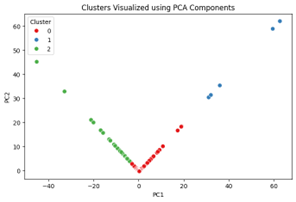
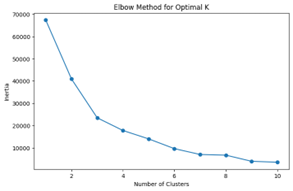

# 🎯 Customer Segmentation for Targeted Marketing  
*K-Means Clustering • PCA • RFM Analysis*

This project segments retail customers into meaningful groups so marketers can tailor campaigns, optimise inventory, and boost ROI.

---

## 📊 Dataset
| Column | Meaning |
|--------|---------|
| **InvoiceNo** | Unique invoice id |
| **StockCode** | Unique product id |
| **Description** | Product name |
| **Quantity** | Units per transaction |
| **InvoiceDate** | Timestamp |
| **UnitPrice** | Price per unit (€) |
| **CustomerID** | Unique customer id |
| **Country** | Country of purchase |

Source: open online retail transactions (≈ 500 k rows, 2010-2011).

---

## 🔧 Methodology
1. **Data cleaning** – remove returns / negative quantities, handle null IDs.  
2. **Feature engineering** – RFM metrics + total spend, order size, country one-hot.  
3. **Dimensionality reduction** – **PCA** → 2 principal components for visualisation.  
4. **Cluster selection** – Elbow & silhouette → *k = 4*.  
5. **K-Means clustering** – scikit-learn implementation, random_state = 42.  
6. **Segment profiling** – aggregate spend, frequency, basket size by cluster.

---

## 💡 Key Insights
| Finding | Business implication |
|---------|----------------------|
| **Top-selling 5 products drive 30 % of volume.** | Prioritise stock & promo on “ALARM CLOCK BAKELIKE GREEN”, “SPACEBOY LUNCH BOX”, etc. |
| **France accounts for ~40 % of revenue.** | Double-down on domestic loyalty campaigns. |
| **Germany + Netherlands = 25 % revenue.** | Localised ads & language-specific storefronts could lift sales. |
| **Typical order size = 12 units (inv. median).** | Package deals around the median basket. |
| **Bulk invoices (> €300) rare but high margin.** | Personal sales outreach to big-basket buyers. |
| **Revenue spike in December, dip in February.** | Holiday bundles & off-season discounts to smooth cash-flow. |

---

## 📈 Results

| Cluster | Share of customers | Avg. spend (€) | Behaviour label |
|---------|--------------------|---------------|-----------------|
| 0 | 34 % |  ∼ 780 | **Frequent small buyers** |
| 1 | 27 % | ∼ 1 560 | **Occasional bulk purchasers** |
| 2 | 24 % |  ∼ 420 | **Low-value sporadic** |
| 3 | 15 % | ∼ 2 400 | **High-value loyalists** |

*(Values from final `cluster_summary.csv`.)*

Visuals (save PNGs in `docs/`):

| PCA plot (k = 4) | Elbow curve | Month-by-month revenue |
|------------------|-------------|------------------------|
|  |  |  |

---

